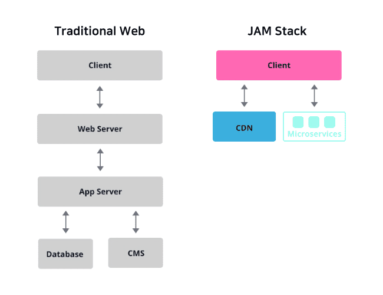

# Gitblog

## 티스토리에서 github 블로그로 옮기게 된 이유

기존에 티스토리에서 블로그를 작성하고 있었다. 하지만 일일커밋도 진행하고 있던 나는 블로그에 쓰는 것 또한 커밋에 포함시키고 싶어서 작성한 내용을 반복해서 깃허브에 올렸었다.
이러한 문제를 해결하고 싶었던 나는 다양한 방법을 생각해 봤다

1. 깃허브에 티스토리 블로그에 쓴 글의 URL을 그대로 작성해두기
2. 깃허브 페이지를 이용한 깃허브 블로그 만들기
3. 블로그를 포기하기
   등등... 다양한 방법을 생각하던 중 1번과 3번은 너무 싫었던 나는 2번을 생각했는데 그동안은 깃허브 페이지를 만드려면 쟈킬언어를 추가로 배워야할꺼라고 생각해서 후일로 미루고 있었다.
   그렇게 시간만 흐르던 중 react기반으로 깃허브 페이지를 만들 수 있다는 것을 알게 되었고 적극 찾아본 결과 react 기반의 gatsby 프레임워크를 사용해서 만들 수 있다는 것을 알게 되었다.
   블로그를 구현하고 나서 구현하면서 알게된 점들을 정리하는 시간을 갖으려고 한다.

## JAM Stack이란?

JAM Stack은 Javascript, API, Markup Stack의 약자.

> (JAM Stack 공식 홈페이지 설명)  
> Jamstack is an architecture designed to make the web faster, more secure, and easier to scale.  
> JAM Stack 은 더 빠르고, 안전하며, 스케일링하기 쉬운 웹을 만들기 위해 디자인된 아키텍처

#### J(JavaScript)

동적인 요소 처리
Front-End 라이브러리, 프레임워크
API 요청

#### A(API)

서버 또는 DB에서 담당하던 역할
추상화된 재사용 가능 API
Cloud Function, Third party APIs

#### M(Markup)

문서 내용의 시각적 표현
빌드 시 페이지 생성 (Prebuilt Pages)

### JAM Stack 동작 원리

  
기존의 웹서비스는 Web Server - App Server - database / CMS(Content Management System)의 구조를 거쳐서 사용자에게 데이터를 전달하는 방식으로 동작했습니다.
이러한 과정은 구조가 복잡하다는 단점이 있었습니다. 반면 JAM Stack은 절차를 매우 간다하게 만들어 사용자에게 전달해주게 된다.

### JAM Stack 장점

- 높은 안정성
- 빠른 성능
- 확장성 및 낮은 비용
- 쉬운 자동화

## Gatsby??

Gatsby는 JAM Stack을 활용하는 정적 페이지 생성기이다. 다영한 정적 페이지 생성기가 있지만 그 중 Gatsby를 사용하는 이유가 있다.

1. 내가 직접 모든걸 만드는 것도 좋지만 프레임워크를 이용해서 제작해보고 싶다는 생각이 듦
2. 리액트를 할줄 알았기 때문에 리액트 기반의 프레임워크가 필요했다. => next, gatsby
3. Next는 주로 동적 페이지를 생성하는 것에 사용된다. 반면 gatsby는 주로 정적 페이지를 제공하는 것에 특화되어있다.
4. 따라서 기술 블로그를 만드는 것에는 Gatsby가 적합하다 생각하여 선택

즉, Gatsby는 서버 없이, 정적 사이트를 생성하기 위해 사용하는 프레임워크이기 때문에 선택하게 되었다.

### SPA vs Gatsby

JavaScript가 실행되면 빈 HTML 페이지 안에 마크업을 추가해주는 SPA(Single Page Application) 와 다르게, 개발 후 Build 과정에서 마크업이 생성됩니다. 페이지 내 모든 콘텐츠가 생성되어있기에 SEO(Search Engine Optimization)와 SPA는 사용하기 까다롭던 Github pages에서도 걱정없이 사용할 수 있다

### Gatsby 구조

#### 1. Data Sources

데이터를 가져올 수 있는 곳, API, CMS, Markdown등 다양한 곳에서 데이터를 가져올 수 있다.

#### 2. Build

Gatsby는 기본적으로 GraphQL을 사용해서 데이터 소스에서 데이터를 가져오는 방식이다. 플러그인을 이용해서 RESTful API에서 가져올 수도 있다.  
코드는 React를 이용해서 컴포넌트를 통해서 구현. react에서 사용하는 기능을 Gatsby에서도 사용할 수 있다.

#### 3. Deploy

Gatsby는 빌드하면 SPA가 아닌 정적 페이지로 빌드한다. GraphQL로 가져온 데이터도 모두 포함되어 있다는 것이 특징이다!
(SPA는 api통신을 통해서 데이터를 가져와야 하지만 Gatsby는 빌드파일에 모두 포함되어 있다)
