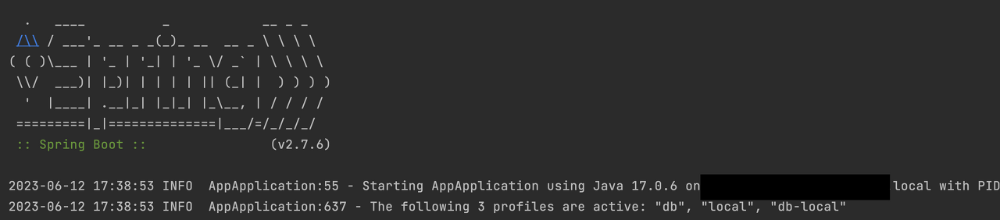

### 사용 이유

현재 진행 중인 프로젝트에서 오라클 클라우드 프리티어를 이용해서 배포 테스트를 진행하게 되었습니다.

현재 application.yml을 서브 모듈 ( [https://teching.tistory.com/144](https://teching.tistory.com/144) )을 사용해서 관리하고 있는 상황이었습니다.

오라클 클라우드의 DB는 특이하게 지갑을 이용해서 접속해야 하는데 그 경로를 지정해주어야 합니다. 예를 들어 DB에 접속하기 위해서라면 아래와 같이 yml을 작성해야 합니다.

```yml
spring:
  datasource:
    url: jdbc:oracle:thin:@sixteens_low?TNS_ADMIN=./src/main/resources/Wallet_sixteens
    username: exam
    password: example!
    driverClassName: oracle.jdbc.OracleDriver
```

위와 같이 현재 위치해 있는 지갑의 경로를 지정해주어야 하는데요.

이를 빌드하여 Docker로 말아야 할 때도 이 경로가 위치한 곳에 지갑을 위치해 두어야 해서 빌드할 때마다 yml을 수정해주어야 해서 매우 불편함을 느꼈고 이를 해결하고자 Spring boot에 있는 profile 기능을 도입하게 되었습니다.

### Profiles 적용하기

> Spring Profiles는 애플리케이션 구성의 일부를 분리하고 특정 환경에서만 사용할 수 있도록 하는 방법을 제공합니다.

공식 문서에서 가져온 문구인데 지금 내게 딱 필요한 기능이 아닐까 싶었습니다.  👍🏻

버전은 spring boot 2.4 이상을 기준으로 하겠습니다. 이전 버전에서 사용되던 profiles 방식은 deprecated 되었습니다...ㅠ

Spring profile은 말 그대로 환경마다 설정을 다르게 적용하고 싶을 때 사용하면 적절한 방법이 될 수 있습니다.

### 기본 사용 방법

#### a. 프로필 설정

1\. 파일명 규칙

```bash
application-{profile}.yml
```

- (properties)로 파일을 만들 때 profile부분에 원하는 프로필명을 넣어주면 스프링이 시작할 때 스캔을 하면서 application-\*. yml을 모두 찾아 config에 저장하게 됩니다.

2\. yml파일 내에서 선언하기

```yml
spring:
  config:
    activate:
      on-profile: '프로필명'
```

- on-profile을 지정하면 해당 프로필명으로 지정이 되게 됩니다.
- \-\-\-를 사용해서 한 파일 내에 구역을 나눠 여러 프로필을 지정할 수 있습니다.
- 만약 on-profile을 지정하지 않는다면 default로 지정이 됩니다.

```yml
server:
  port: 8080
---
spring:
  config:
    activate:
      on-profile: a

server:
  port: 8888

---
spring:
  config:
    activate:
      on-profile: b

server:
  port: 9999
```

- 아무 프로필을 활성화하지 않는다면 포트가 8080
- a 프로필 활성화 시 8888, b 프로필 활성화시 9999 포트로 지정되게 할 수 있다.

#### b. 프로필 활성화 방법

1\. yml에서 활성화시키기

```yml
spring:
  profiles:
    active:
      - 활성화할 profile 명
    group:
      그룹으로 묶을 이름:
        - 활성화 시킬 프로필
      그룹으로 묶을 이름2:
        - 활성화 시킬 프로필
    include:
      - 모든 그룹에 포함시킬 프로필1
      - 모든 그룹에 포함시킬 프로필2
```

- active에는 기본적으로 활성시킬 프로필 명을 적어주면 됩니다.
- group은 프로필들을 모아 새로운 프로필로 만들어주는 기능을 합니다.
- include는 모든 프로필에 기본적으로 포함시킬 프로필명들을 적어주면 됩니다.

2\. 코드에서 어노테이션으로 적용하기

```java
@Component
@Profile("프로필명")
public class DevDatasourceConfig
```

- 이와 같이 활성화시킬 profile명을 @Porfile의 값에 넣어주면 됩니다.

3\. 실행 시 옵션으로 프로필 선택하기

\-Dspring.profiles.active 옵션을 사용하면 실행시 프로필을 선택할 수 있습니다!

### 사용 예시

사용 예시를 통해서 적용 방법을 좀 더 알아보도록 하겠습니다.  
예시 상황은 local에서 개발할 때와 prod로 배포할 때 DB접속을 다르게 하고 싶은 상황입니다. 또한 applicaiton.yml을 따로 관리하고 싶어 디렉터리를 두고 그곳에서 관리하고 있는 상황이라고 가정하겠습니다.

0\. 폴더 구조

```bash
/resources
  /config
    /Wallet_example
      ...지갑파일들
    application-db.yml
  application.yml
```

1\. application-db.yml

```yml
--- # defalut 공통 설정
spring:
  jpa:
    properties:
      hibernate:
        dialect: org.hibernate.dialect.Oracle12cDialect
        format_sql: true
        use_sql_comment: true
        show_sql: true
--- # local
spring:
  config:
    activate:
      on-profile: 'db-local'
  datasource:
    url: jdbc:oracle:thin:@example_low?TNS_ADMIN=./src/main/resources/Wallet_example
    username: exam
    password: example!
    driverClassName: oracle.jdbc.OracleDriver
--- # oracle 클라우드
spring:
  config:
    activate:
      on-profile: 'db-prod'
  datasource:
    url: jdbc:oracle:thin:@example_low?TNS_ADMIN=/var/Wallet_example
    username: exam
    password: example!
    driverClassName: oracle.jdbc.OracleDriver
```

- 기본적으로 profile은 application-{profile}.yml (properties) 형태로 작성해 두어야 합니다. (스캔할 때 config에 \*.yml로 import 하기 때문입니다.)
- `---` : 설정 정보를 분리시킬 수 있습니다. (properties에서는 `#---` 로 구분해야 합니다)
- 각 환경별로 설정 정보를 다르게 적용하여 prod환경에서는 /var/Wallet_eample에 위치한 지갑을 사용하도록 하였습니다.
  - 이는 후에 Docker로 빌드할 때 /var/Wallet_example 위치에 지갑을 위치하도록 해야 합니다!

2\. application.yml

```yml
spring:
  config:
    import:
      - classpath:config-file/application-db.yml

  application:
    name: example
  profiles:
    include:
      - db
    active:
      - local
    group:
      local:
        - db-local
      prod:
        - db-prod
      prod:
```

- import 문은 현재 application-db.yml이 application.yml과 다른 디렉토리에 위치하고 있기 때문에 import를 통해서 설정을 추가해주어야 합니다.
  - 같은 디렉토리에 위치한 .yml (.properties)는 자동으로 스프링 부트가 찾아주기 때문에 import로 넣지 않아도 괜찮습니다.
- include는 기본적으로 포함시킬 profile을 선택하는 것입니다. 예시에서는 db만 추가하면 됐으니 db를 추가해 주었습니다.
  - on-profile을 설정하지 않는다면 default로 동작하게 됩니다. 따라서 위와 같이 공통 설정이 있는 경우 추가해주어야 합니다.
- active는 현재 동작시킬 profile을 선택하는 것입니다. 환경을 설정하는 방법에는 여러 가지 방법이 있습니다. 후에 추가로 작성하겠습니다!
- group은 여러 설정들을 합쳐 하나의 profile로 묶는 기능입니다.
  - 여기에서는 local에는 db-local을 포함시키고 prod에는 db-prod을 포함시키게 됩니다.
  - 한 개의 프로필을 사용할 때는 없어도 괜찮지만 관련 설정들을 추가할수록 관리하기가 어렵기 때문에 group으로 묶어서 한 번에 관리하는 것이 좋아 보입니다.

이렇게 구성한 서버를 동작시켜 보면



```text
The following 3 profiles are active: "db", "local", "db-local"
```

문구를 확인해 보면 현재 db, local, db-local프로필들이 활성화되는 것을 확인할 수 있습니다.

만약 jar를 실행할 때 profile을 결정하고 싶다면 jar를 실행할때 아래와 같이 -Dspring.profiles.active={설정할 profile이름}을 사용하면 실행환경에서 profile을 변경할 수 있습니다!

```bash
java -jar -Dspring.profiles.active=prod /app.jar
```
